# Layout study — three pages of IRS.gov, as GIFrs

**Live:** [`https://gregoryedgerton.github.io/golden-grids-study-09-irs/`](https://gregoryedgerton.github.io/golden-grids-study-09-irs/)

An unaffiliated layout study. It rebuilds the structure of three pages of
IRS.gov — the [home page](https://www.irs.gov/), [Make a payment](https://www.irs.gov/payments)
and [Online account for individuals](https://www.irs.gov/payments/online-account-for-individuals)
— as stacked golden grids under the GIFrs brand. The text is the
Internal Revenue Service's own, a work of the United States government in
the public domain (17 U.S.C. §105), shortened and rearranged and linked to
its page; the shell says on every page that this is not a government
website and that no control signs in or pays. Nothing of the IRS's design,
seal or marks is reproduced. Built with
[Golden Grids](https://github.com/gregoryedgerton/golden-grids) from the
[study template](https://github.com/gregoryedgerton/golden-grids-study-template).

## Reference

The three pages, captured 2026-10-07 at 390 / 820 / 1440
([`captures/reference-*.png`](captures/), main text in
`captures/reference-*.txt`). IRS.gov applies the U.S. Web Design System:
a thin government banner, a dark-blue brand bar, a primary navigation row,
and pages of equal cards and equal headings — six "Popular topics" cards in
two rows of three, six payment-method cards in two rows of three, a
carousel of five news cards, eight account features as a column of
headings with bullets, and a left navigation with a right "Related" column
on inner pages. Measured tokens ([`captures/tokens.json`](captures/tokens.json)):
Source Sans Pro at 16px/24px in `#1b1b1b`, link blue `#00599c`, brand
`#002d62`, greys `#f9f9f9` and `#f0f0f0`, `#d6d7d9` hairlines, 8px radii.

| Width | Home | Make a payment | Online account |
| --- | --- | --- | --- |
| 390px | 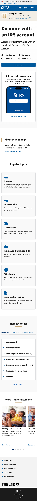 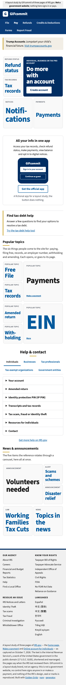 | 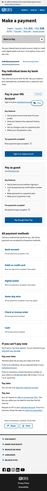 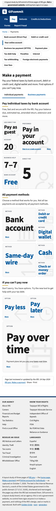 | 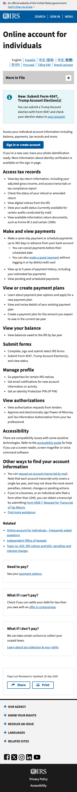 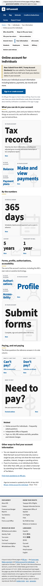 |
| 1440px | 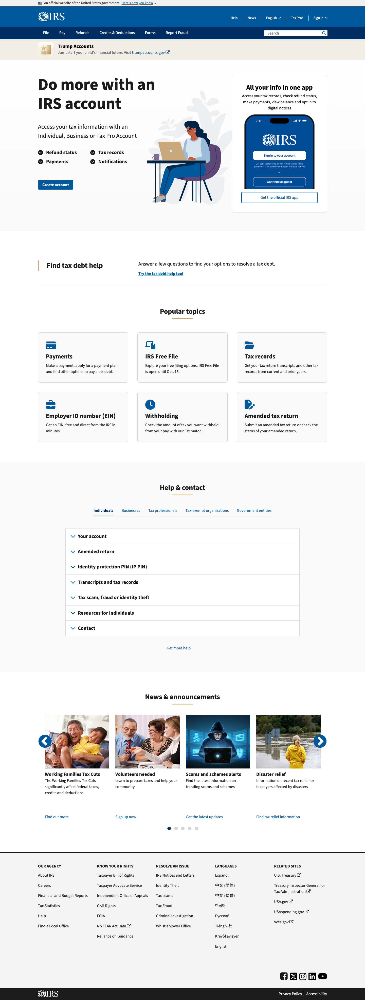 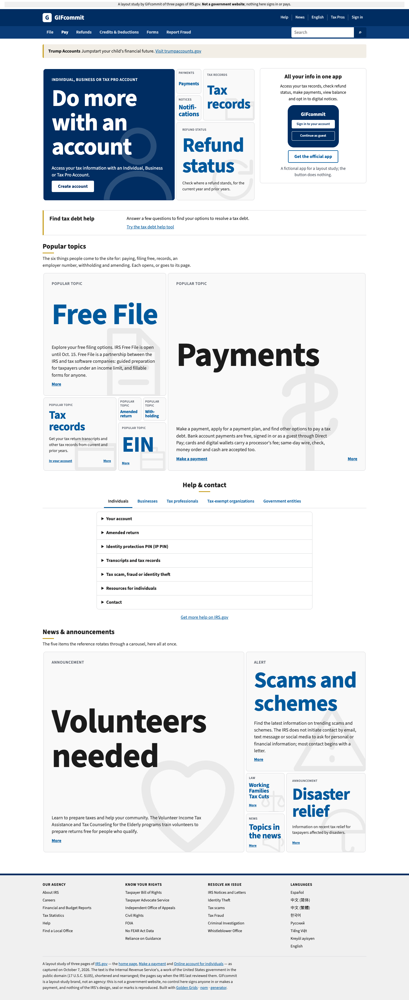 | 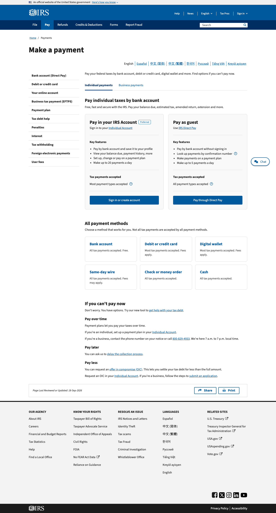 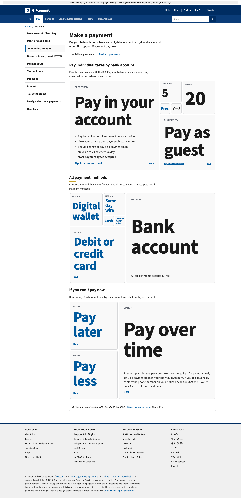 | 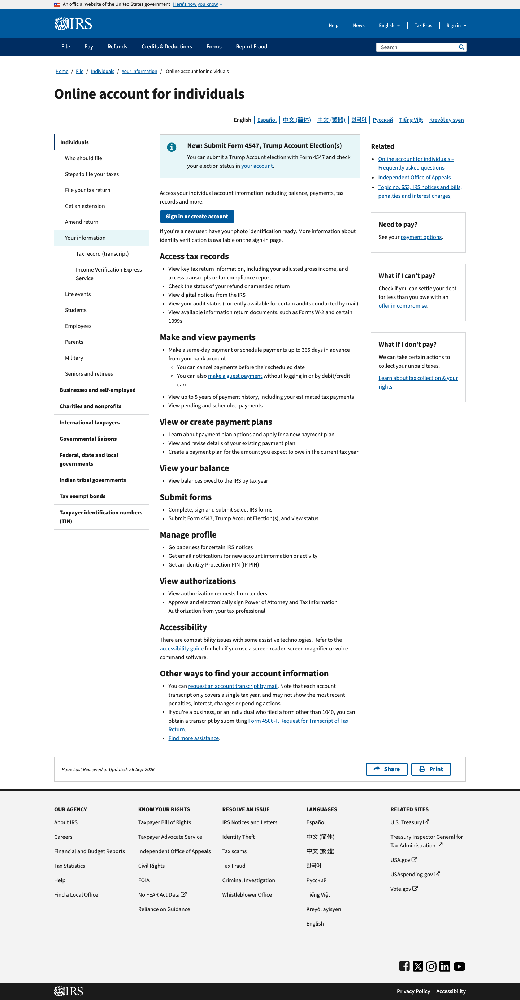 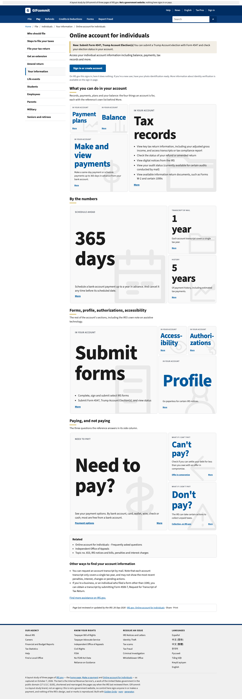 |

## Approach

The reference presents its topics, payment methods and account features as rows of equal cards and columns of equal headings. The study sets each row as one grid, with the first item in the largest square carrying its full text and the rest in descending squares with their lists one step away. Which item comes first follows the reference's own order.

## The pages

Three Vite entries, plain links; `src/lib/Page.tsx` is the shell (banner,
brand bar, navigation, breadcrumb, left navigation, footer columns). Flat
modules stay flat: the notice strip, the tax-debt callout, the Help &
contact tabs and accordion, the app card, the sign-in intro, Related, the
reviewed-on line. Below desktop a five- or six-square band is dealt into two
grids so no square is under about 114px. Measured sizes are the grid's
width×height at 390 / 820 / 1440.

| Page · band | Range · placement · cw (desktop) | Measured | What it holds |
| --- | --- | --- | --- |
| Home · Do more with an account | 1–5 · top · cw | 358×239+179 / 788×525+394 / 749×468 | The headline and Create account; refund status, tax records, payments, notices |
| Home · Popular topics | 1–6 · right · cw | 2×(358×239) / 2×(788×525) / 1140×702 | Payments, Free File, tax records, EIN, withholding, amended return |
| Home · News & announcements | 1–5 · bottom · ccw | 358×239+179 / 788×525+394 / 1140×713 | The carousel's five items at once |
| Payments · Pay by bank account | 1–6 · left · cw | 2×(358×239) / 2×(788×525) / 876×539 | Pay in your account (preferred), pay as guest; 20, 5, Free, 7–7 |
| Payments · All payment methods | 1–6 · right · ccw | 2×(358×239) / 2×(788×525) / 876×539 | Bank account, card, wallet, wire, check, cash |
| Payments · If you can't pay now | 1–3 · top · cw | 358×537 / 788×525 / 876×584 | Pay over time, later, less |
| Account · What you can do | 1–4 · left · ccw | 358×597 / 788×473 / 876×526 | Tax records, payments, plans, balance |
| Account · By the numbers | 1–3 · bottom · cw | 358×537 / 788×525 / 876×584 | 365 days, 5 years, 1 year |
| Account · Forms, profile, … | 1–4 · right · cw | 358×597 / 788×473 / 876×526 | Submit forms, profile, authorizations, accessibility |
| Account · Paying, and not paying | 1–3 · top · ccw | 358×537 / 788×525 / 876×584 | The side column's three questions |

All eight placement × direction orientations appear at desktop.

## The subject

Every sentence in `src/content.ts` is from the three pages as captured on
October 7, 2026 (the IRS last reviewed them on 18-Sep-2026 and
26-Sep-2026, as each page prints), or a short gloss on them: the two ways
to pay by bank account and their daily limits (20 signed in, 5 as a guest),
the six payment methods and which charge fees, the three options when you
cannot pay, the eight sections of an individual's online account and their
bullets, the home page's topics, help list and announcements. A few
expansions add a sentence of context (what an EIN is, who sets card fees)
in the same plain register. No photograph is used; the only drawings are the study's own icons.

## How it works

- Every card is a `Fact` ([`src/lib/boxes.tsx`](src/lib/boxes.tsx)) with
  its heading fitted by [`src/lib/fit.tsx`](src/lib/fit.tsx), capped at
  120px; the first in each band is the hero and carries the fuller text,
  the rest show one line of body and open the whole list with More. Where
  the reference has a link, the square has one (Payments, In your account).
- Behind each square's text sits a large faint line icon drawn for the
  study ([`src/icons.tsx`](src/icons.tsx), one per topic: a bank, a card, a
  clock, a folder, a key, a bell), the reference's small card icon made the
  card's ground; it is decorative and clipped by the box, and hidden in a
  square under 90px.
- Body copy appears from 200px of height, the fuller passage from 320px,
  and a list of bullets from 480px, so a hero square carries the
  reference's whole list and a small square its first line.
- Controls that would sign in, pay or download say so and do nothing.
- Light is the reference's; dark is the study's, the same values turned
  over, by device preference.
- [`captures/scan.cjs`](captures/scan.cjs), Chrome and WebKit, 390 / 820 /
  1440, light and dark, all three pages: nothing overflows, no fitted line
  under 12px, axe (WCAG 2.0/2.1/2.2 A/AA, best practice) clean with a More
  open. No screen-reader user has tested it.

## Notes for review

Observations for whoever reviews this study, recorded without a verdict. Whether the layout suits the page is assessed separately, after every study has been reviewed.

- **Home hero.** It shares a row with the app card, so at 1440 its five-square grid is 749px wide; the reference's hero is a two-column promotion.
- **Help and contact.** Only the Individuals list is rebuilt; the reference has one for each of five audiences.
- **Navigation.** The reference's left navigation and footer link to pages this study does not have; those items are shown as text.
- **Order as size.** The reference draws "Bank account" and "Cash" at one size; here the first is larger because it comes first.

## Disclosure

Every page says what it is in three places, all read from
[`src/study.json`](src/study.json): its title and description, a sticky notice
at the top, and a disclosure at the very end listing the pages reviewed, what
is real, what is invented or changed, and where each kind of asset came from.

## Study tools

Hidden by default (`?tools=1` shows the panel); `g`, `n` and `m` toggle grid
outlines, band notes and reduced motion.

## Running and deploying

```bash
npm install
npm run dev
```

`npm run build` type-checks and builds to `dist/`; pushing to `main` deploys
to GitHub Pages. The library is consumed from npm at its published version,
never linked locally.
